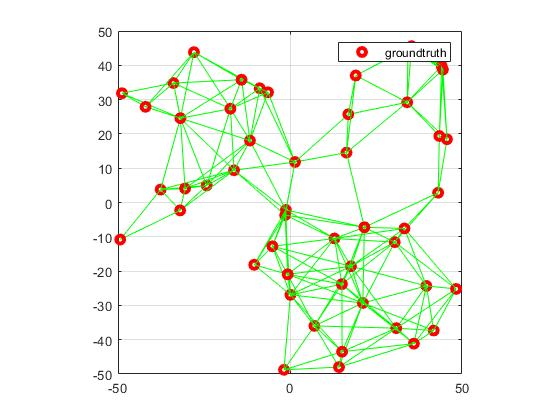
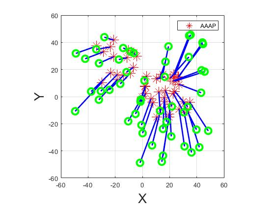
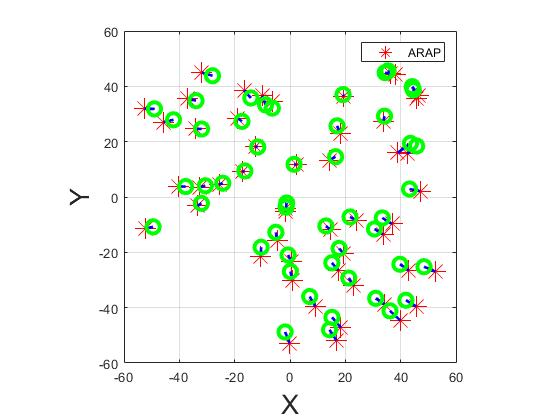
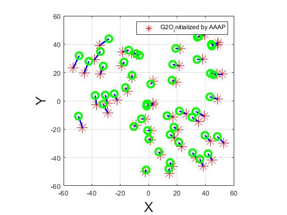

# SparseNetworkLocalization
Sparse network localization using only distance measurements

# 2020-05-22
# ycw@ruc.edu.cn

#introduction of the program

1. Generate a sparse network with partially measured internode distances. 

2. Initialized the network realization by AAAP

3. Use AAAPos as initialization result to run ARAP

4. Use AAAP as initalization to run G2O

5. The localization performances under different sparsity and ranging noises can be measured. 

